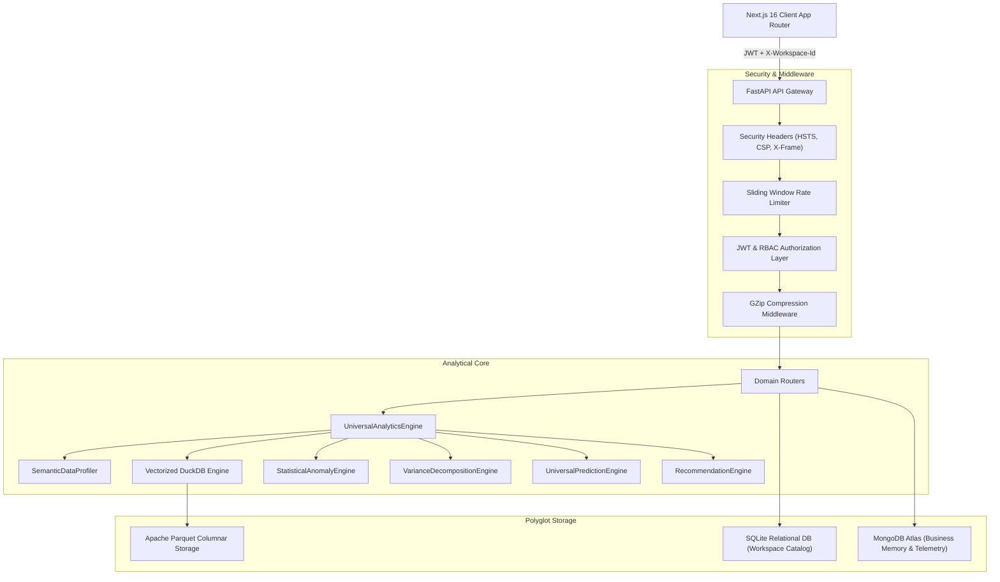

# DecisionLens System Architecture & Design

## 1. System Overview
DecisionLens is an enterprise decision intelligence platform engineered to transform raw operational datasets into board-ready executive intelligence, automated root cause investigations, time-series forecasts, and strategic priority roadmaps.

## 2. 14-Stage Analytical Pipeline
1. **User Client**: Role-aware executive dashboard presenting KPIs, Recharts charts, scenario simulator, and Copilot.
2. **API Gateway**: Authenticates incoming requests, verifies CSRF/JWT tokens, tracks latency, and resolves workspace context.
3. **Enterprise Security**: Constant-time password/JWT verification, strict RBAC policy, file upload magic bytes validation.
4. **Data Ingestion**: Multi-format ingestion (CSV, XLSX, Parquet, ZIP) with automatic staging.
5. **Semantic Profiling**: Auto-detects data types, measures, dimensions, temporal columns, and business domains.
6. **Universal Analytics Engine**: Orchestrates statistical modules into a canonical `AnalyticsResult` payload.
7. **Anomaly & Outlier Engine**: Identifies statistical outliers using IQR and rolling z-scores.
8. **Variance Decomposition Engine**: Quantifies driver contributions across dimensional hierarchies.
9. **Machine Learning & Time Series**: Performs Prophet/ARIMA/Exponential Smoothing forecasts with confidence bands.
10. **Business Health & Scoring Engine**: Calculates composite business health scores (0-100).
11. **Copilot & AI Assistant**: Grounded conversational analytics using local analytical context.
12. **Strategy & Decision Center**: Derives strategic priorities, risk matrices, and actionable recommendations.
13. **Board Reporting Engine**: Generates 13-section Executive Board Reports and PDF/DOCX exports.
14. **Polyglot Storage Warehouse**: In-memory vectorized DuckDB backed by Parquet, SQLite, and MongoDB.
